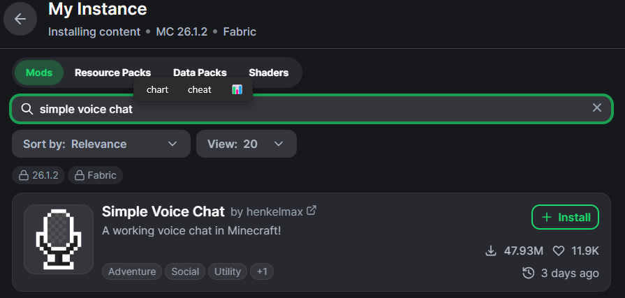
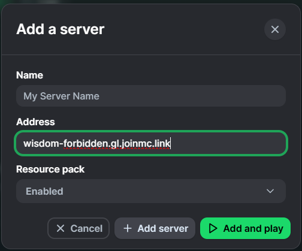

Participants must install the Simple Voice Chat mod for proximity audio.

## Recommended Setup (Modrinth App)

1. Install the [Modrinth App](https://modrinth.com/app)
2. Create a new instance and select Fabric as your loader

   
   
   

3. Search for and install Simple Voice Chat

   

   

4. Worlds → Add a Server

   

5. Launch the game - Play ▶️

   

## Manual Installation

1. Install the Fabric Loader
2. Download the Simple Voice Chat .jar file matching Minecraft 26.1.2
3. Place the file in your local mods folder:
   - **Windows:** `%appdata%\.minecraft\mods`
   - **Linux:** `~/.minecraft/mods`
